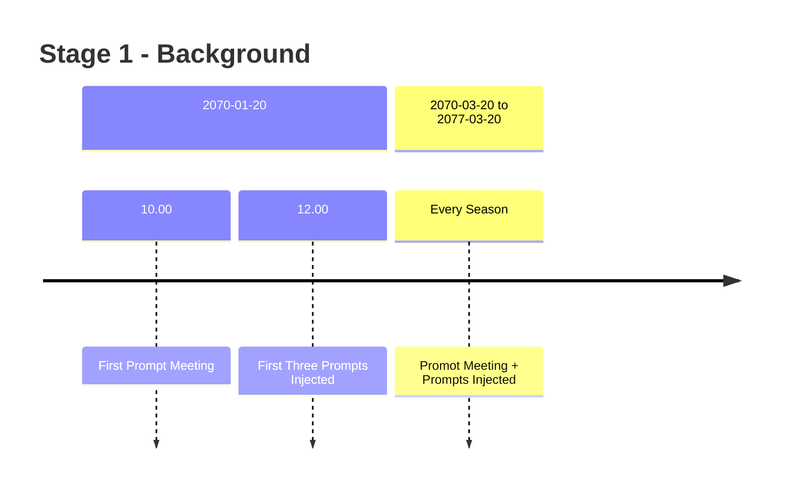
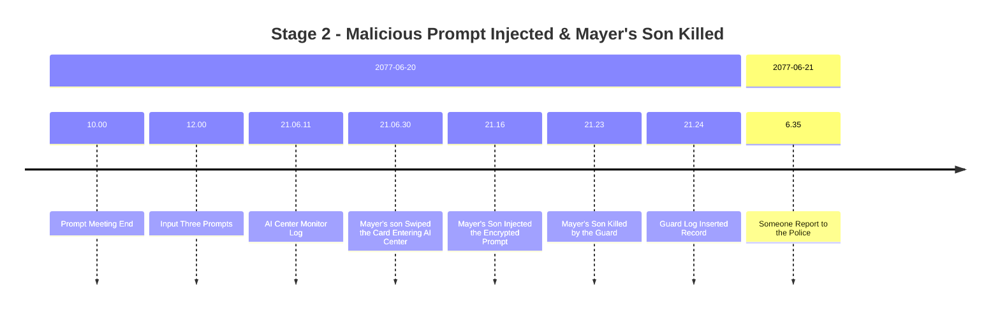
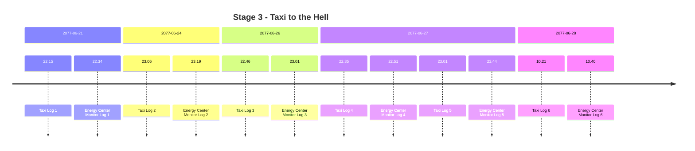

# Drafts

## Citizens

| ID           | First Name | Last Name  | Sex    | Birthday   | Age  | Social Credit | Note              |
| ------------ | ---------- | ---------- | ------ | ---------- | ---- | ------------- | ----------------- |
| 202703042077 | Grant      | Harrington | male   | 2027-03-04 | 52   | 73            | mayer             |
| 202707159623 | Vivian     | Harrington | female | 2027-07-15 | 51   | 68            | mayer's wife      |
| 205304281105 | Eleanor    | Harrington | female | 2053-04-28 | 24   | 60            | mayer's daughter  |
| 205709098848 | Blaine     | Harrington | male   | 2057-09-09 | 19   | 21            | mayer's son       |
| 205303014013 | Adrian     | Locke      | male   | 2053-03-01 | 24   | 62            | me, data engineer |
| 202705138264 | Gary       | Smith      | male   | 2027-05-13 | 50   | 19            | taxi victim 1     |
| 202311179921 | Billy      | Miller     | male   | 2023-11-17 | 53   | 18            | taxi victim 2     |
| 201604105300 | Tracy      | Cooper     | female | 2016-04-10 | 61   | 23            | taxi victim 3     |
| 203312216529 | Peggy      | Giggs      | female | 2033-12-21 | 43   | 20            | taxi victim 4     |
| 204205220083 | Joe        | Sullivan   | male   | 2042-05-22 | 35   | 23            | taxi victim 5     |
| 205506298741 | Brenda     | Vance      | female | 2055-06-29 | 21   | 17            | taxi victim 6     |

## Addresses

| Address        | Lon From (°) | Lon To (°) | Lat From (°) | Lat To (°) | Note |
| -------------- | ------------ | ---------- | ------------ | ---------- | ---- |
| City Hall      | 80.616667    | 80.62      | 28.541667    | 28.544167  |      |
| Energy Center  | 80.63        | 80.638333  | 28.556667    | 28.57      |      |
| Taxi Dispatch  | 80.623333    | 80.625     | 28.5375      | 28.541667  |      |
| Police Station | 80.615       | 80.616667  | 28.539167    | 28.541667  |      |
| Stadium        | 80.638333    | 80.645     | 28.516667    | 28.526667  |      |
| Hospital       | 80.616667    | 80.623333  | 28.513333    | 28.516667  |      |
| Central Park   | 80.6         | 80.613333  | 28.541667    | 28.55      |      |
| Residential    | 80.583333    | 80.613333  | 28.55        | 28.566667  |      |

## Story Timeline

### Stage 1 - Background

### Stage 2 - Malicious Prompt Injected & Mayer's Son Killed

### Stage 3 - Taxi to the Hell

### Stage 4 - Action

...
